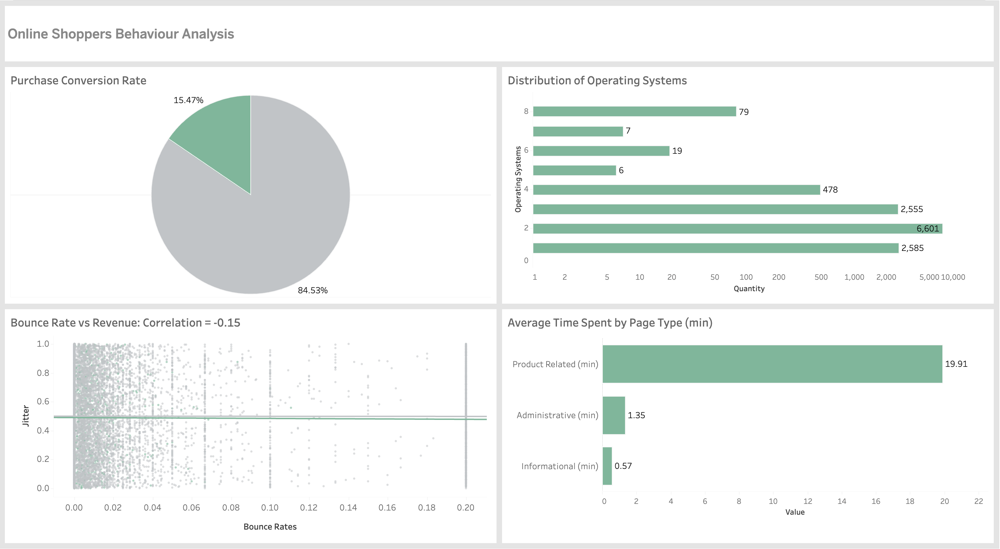

## Online Shoppers Behaviour Analysis

An exploratory data analysis and Tableau visualization project based on the Online Shoppers Purchasing Intention dataset.

## Dashboard

👉 [View Interactive Dashboard on Tableau Public](https://public.tableau.com/app/profile/amina.baiturgan/viz/OnlineShoppersBehaviourAnalysis/-#1)

## Dataset

Source: [Original GitHub Repository](https://github.com/thsuul/online-shoppers-behaviour-analysis)

File: online_shoppers_intention.xlsx

Records: ~12,300 sessions

Features: Administrative, Informational, ProductRelated pages, BounceRates, ExitRates, Revenue, OperatingSystems, and more

## Questions Answered

| # | Question | Key Finding |
|---|----------|-------------|
| 1 | What is the proportion of visitors who made a purchase? | 15.47% conversion rate |
| 2 | What is the distribution of pages visited? | Visitors spend most time on Product Related pages (avg 19.9 min) |
| 3 | What is the average time spent on the website? | Overall avg 21.8 min per session |
| 4 | What is the correlation between bounce rate and revenue? | -0.15 — weak negative correlation |
| 5 | What is the distribution of operating systems? | OS 2 dominates with 53.54% of visitors |

## Visualizations

Pie Chart — Purchase Conversion Rate (TRUE vs FALSE)
Bar Chart — Distribution of Operating Systems
Bar Chart — Average Time Spent by Page Type
Scatter Plot — Bounce Rate vs Revenue with trend lines (Correlation = -0.15)

## Tools Used

Microsoft Excel — data analysis & calculations
Tableau Public — interactive dashboard

## Key Insights

Only 1 in 6 visitors makes a purchase
Visitors spend the majority of their time (~92%) on product-related pages
Higher bounce rate is weakly associated with lower purchase probability
OS 2 accounts for over half of all sessions
